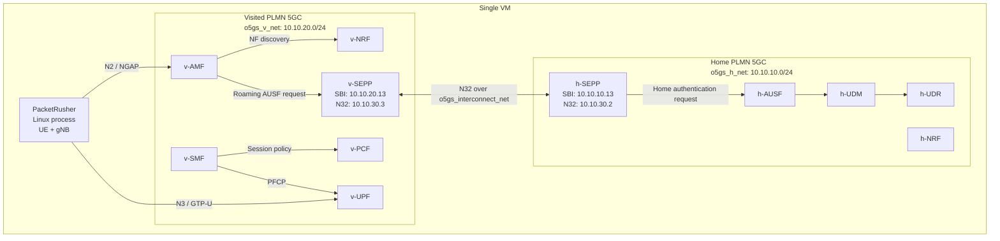
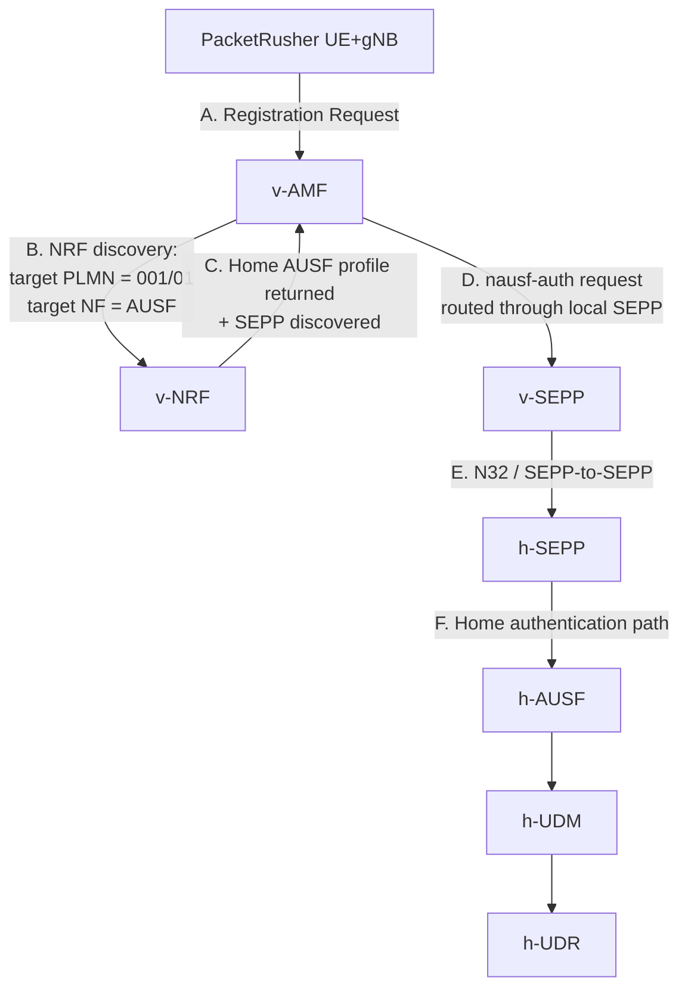

# Building SEPP-Based 5G Roaming with Open5GS, Docker, and PacketRusher

This article documents a working **5G SA roaming lab** using **Open5GS**, **SEPP-to-SEPP communication**, Docker Compose, and PacketRusher.

The goal is to build a lab-friendly but conceptually correct roaming environment where:

- the **Home PLMN** and **Visited PLMN** run as two separate Docker Compose deployments,
- each PLMN has its own Docker bridge network,
- a third Docker network is used only for **SEPP ↔ SEPP N32 signaling**,
- the UE/gNB simulator, **PacketRusher**, runs as a Linux process on the same VM,
- roaming registration is authenticated by the **Home PLMN**,
- the PDU session is established in the **Visited PLMN** using **Local Breakout (LBO)**.

This is not meant to be a production roaming architecture. It is a clean lab implementation that keeps the important roaming ideas visible: PLMN separation, NRF discovery, SEPP/N32 routing, and local user-plane breakout.

The full Docker Compose files and Open5GS YAML configs are better kept in a GitHub repository. In this article, I only show the critical pieces that explain the design.

> GitHub repository: `TODO: add your repository URL here`

---

## 1. Prerequisites

This demonstation has been built on top of [docker-open5gs](https://github.com/Borjis131/docker-open5gs) repo, so any interested user should follow the instructions in that repo to build the docker images and the containerized open5gs in general.

In that repo, there is a `.env` file in the parent path of the repo with `DOCKER_HOST_IP` variable, which is the VM's IP.

---

## 2. PLMN Plan

This lab uses two PLMNs:

| Role | MCC | MNC | PLMN label |
|---|---:|---:|---|
| Home PLMN | `001` | `01` | `mnc001.mcc001` |
| Visited PLMN | `999` | `70` | `mnc070.mcc999` |

The roaming UE belongs to the **Home PLMN** (`001/01`) but attaches through the **Visited PLMN** (`999/70`).

That distinction is critical. If the UE SUPI/SUCI uses `999/70`, the visited AMF treats it as a local subscriber and will not trigger roaming. The UE identity must contain the Home PLMN so that the visited AMF discovers the Home AUSF/UDM path through SEPP.

---

## 3. Docker Network Plan

The single VM contains three Docker networks:

| Network | Subnet | Purpose |
|---|---|---|
| `o5gs_h_net` | `10.10.10.0/24` | Home core internal network |
| `o5gs_v_net` | `10.10.20.0/24` | Visited core internal network |
| `o5gs_interconnect_net` | `10.10.30.0/24` | SEPP-to-SEPP N32 interconnect only |

The key design rule is simple:

> Only `h-sepp` and `v-sepp` are connected to `o5gs_interconnect_net`.

All other NFs remain isolated inside their own PLMN network.

In both Docker Compose projects, the interconnect is referenced as an external network:

```yaml
networks:
  o5gs_interconnect_net:
    external: true
```

This is the first important Compose detail. The interconnect network is not owned by either the Home or Visited Compose project. It is a shared Docker bridge used only for SEPP-to-SEPP communication.

---

## 4. High-Level Architecture



For the **LBO roaming case**, the decisive functions are:

| Side | Important NFs |
|---|---|
| Home | `h-nrf`, `h-ausf`, `h-udm`, `h-udr`, `h-sepp` |
| Visited | `v-nrf`, `v-amf`, `v-smf`, `v-upf`, `v-pcf`, `v-sepp` |

The Compose files can still contain a more complete set of NFs. That is useful for a full lab, but the roaming path above is the important part.

---

## 5. Why SEPP Needs Two Logical Identities

Each SEPP uses two practical identities:

| Purpose | Example |
|---|---|
| Local SBI endpoint | `sepp.5gc.mnc001.mcc001.3gppnetwork.org` |
| SEPP peer / N32 endpoint | `sepp-n32.5gc.mnc001.mcc001.3gppnetwork.org` |

The **SBI FQDN** is used by local NFs in the same PLMN. The **SEPP peer/N32 FQDN** is used by the peer SEPP across the interconnect network.

In this single-VM Docker lab, each SEPP is dual-homed:

| SEPP | Local SBI IP | N32 interconnect IP |
|---|---|---|
| `h-sepp` | `10.10.10.13` | `10.10.30.2` |
| `v-sepp` | `10.10.20.13` | `10.10.30.3` |

---

## 6. Docker Compose Excerpts: Only SEPP Is Dual-Homed

The full Docker Compose files are available in the GitHub repository. In the article, I only show the SEPP-related part because this is the key design decision:

> all NFs stay inside their own PLMN Docker network, while only the two SEPPs are dual-homed into the interconnect network.

### Home SEPP Compose Excerpt

```yaml
h-sepp:
  container_name: h-sepp
  image: "sepp:${OPEN5GS_VERSION}"
  command: "-c /etc/open5gs/custom/sepp.yaml"

  extra_hosts:
    - "sepp-n32.5gc.mnc070.mcc999.3gppnetwork.org:10.10.30.3"

  networks:
    o5gs_interconnect_net:
      ipv4_address: 10.10.30.2
      aliases:
        - sepp-n32.5gc.mnc001.mcc001.3gppnetwork.org

    o5gs_h_net:
      ipv4_address: 10.10.10.13
      aliases:
        - sepp.5gc.mnc001.mcc001.3gppnetwork.org

  configs:
    - source: sepp_config
      target: /etc/open5gs/custom/sepp.yaml

  depends_on:
    - h-nrf
```

The Home SEPP is attached to two networks:

| Network | Purpose |
|---|---|
| `o5gs_h_net` | Local Home PLMN SBI traffic |
| `o5gs_interconnect_net` | SEPP-to-SEPP N32 traffic |

The important point is that `h-sepp` resolves the peer visited SEPP N32 FQDN to the visited SEPP interconnect IP:

```yaml
extra_hosts:
  - "sepp-n32.5gc.mnc070.mcc999.3gppnetwork.org:10.10.30.3"
```

### Visited SEPP Compose Excerpt

```yaml
v-sepp:
  container_name: v-sepp
  image: "sepp:${OPEN5GS_VERSION}"
  command: "-c /etc/open5gs/custom/sepp.yaml"

  extra_hosts:
    - "sepp-n32.5gc.mnc001.mcc001.3gppnetwork.org:10.10.30.2"

  networks:
    o5gs_interconnect_net:
      ipv4_address: 10.10.30.3
      aliases:
        - sepp-n32.5gc.mnc070.mcc999.3gppnetwork.org

    o5gs_v_net:
      ipv4_address: 10.10.20.13
      aliases:
        - sepp.5gc.mnc070.mcc999.3gppnetwork.org

  configs:
    - source: sepp_config
      target: /etc/open5gs/custom/sepp.yaml

  depends_on:
    - v-nrf
```

The Visited SEPP follows the same pattern:

| Network | Purpose |
|---|---|
| `o5gs_v_net` | Local Visited PLMN SBI traffic |
| `o5gs_interconnect_net` | SEPP-to-SEPP N32 traffic |

The visited side maps the Home SEPP N32 FQDN to the Home SEPP interconnect IP:

```yaml
extra_hosts:
  - "sepp-n32.5gc.mnc001.mcc001.3gppnetwork.org:10.10.30.2"
```
---

## 7. SEPP Configuration Excerpts

The SEPP YAML files must also bind the local SBI side and the N32 side separately.

### Home SEPP Config

```yaml
sepp:
  sbi:
    server:
      - address: sepp.5gc.mnc001.mcc001.3gppnetwork.org
        port: 80
    client:
      nrf:
        - uri: http://nrf.5gc.mnc001.mcc001.3gppnetwork.org:80

  n32:
    server:
      - sender: sepp-n32.5gc.mnc001.mcc001.3gppnetwork.org
        address: sepp-n32.5gc.mnc001.mcc001.3gppnetwork.org
        port: 80
    client:
      sepp:
        - receiver: sepp-n32.5gc.mnc070.mcc999.3gppnetwork.org
          uri: http://sepp-n32.5gc.mnc070.mcc999.3gppnetwork.org:80
```

### Visited SEPP Config

```yaml
sepp:
  sbi:
    server:
      - address: sepp.5gc.mnc070.mcc999.3gppnetwork.org
        port: 80
    client:
      nrf:
        - uri: http://nrf.5gc.mnc070.mcc999.3gppnetwork.org:80

  n32:
    server:
      - sender: sepp-n32.5gc.mnc070.mcc999.3gppnetwork.org
        address: sepp-n32.5gc.mnc070.mcc999.3gppnetwork.org
        port: 80
    client:
      sepp:
        - receiver: sepp-n32.5gc.mnc001.mcc001.3gppnetwork.org
          uri: http://sepp-n32.5gc.mnc001.mcc001.3gppnetwork.org:80
```

The key line is the `n32.server.address`. Without it, the SEPP process may not listen on the intended interconnect-facing address.

---

## 8. SEPP Roaming Flow

The key registration/authentication path is:



After authentication succeeds, the UE continues with security mode, registration accept, and PDU session setup.

Because this is **LBO**, the PDU session is controlled by the **Visited SMF** and anchored by the **Visited UPF**. The Home PLMN authenticates the subscriber, but the user plane exits locally through the visited side.

---

## 9. Visited AMF and PCF Roaming Pieces

The Visited AMF must allow both the visited PLMN and the home PLMN in `access_control`.

```yaml
amf:
  access_control:
    - plmn_id:
        mcc: 999
        mnc: 70
    - plmn_id:
        mcc: 001
        mnc: 01

  guami:
    - plmn_id:
        mcc: 999
        mnc: 70
      amf_id:
        region: 2
        set: 1

  tai:
    - plmn_id:
        mcc: 999
        mnc: 70
      tac: 1

  plmn_support:
    - plmn_id:
        mcc: 999
        mnc: 70
      s_nssai:
        - sst: 1
```

The Visited PCF provides the policy used for the roaming subscriber range:

```yaml
pcf:
  policy:
    - supi_range:
        - 001010000000001-001019999999999
      slice:
        - sst: 1
          default_indicator: true
          session:
            - name: internet
              type: 3
              ambr:
                downlink:
                  value: 1
                  unit: 3
                uplink:
                  value: 1
                  unit: 3
              qos:
                index: 9
```

This static policy block represents the roaming policy agreement for Home PLMN subscribers in this lab.

---

## 10. Visited SMF and UPF for Local Breakout

The Visited SMF controls the PDU session and uses the Visited UPF.

```yaml
smf:
  session:
    - subnet: 10.45.0.0/16
      gateway: 10.45.0.1

  dnn:
    internet:
      dev: ogstun
```

The Visited UPF anchors the user-plane session:

```yaml
upf:
  session:
    - subnet: 10.45.0.0/16
      gateway: 10.45.0.1
      dnn: internet
```

The `10.45.0.0/16` subnet is the UE PDU session pool. It is not a Docker subnet.

---

## 11. PacketRusher as a Linux Process

PacketRusher runs on the same VM, not as a container. This simplifies the installation and use of the `gtp5g` kernel module, which is required for GTP tunneling.

A typical PacketRusher config pattern is:

```yaml
gnodeb:
  controlif:
    ip: "<VM_IP>"
    port: 9487
  dataif:
    ip: "<VM_IP>"
    port: 2152
  plmnlist:
    mcc: "999"
    mnc: "70"
    tac: "000001"
    gnbid: "000001"
  slicesupportlist:
    sst: "01"

ue:
  msin: "0000000120"
  key: "<same-as-home-subscriber-K>"
  opc: "<same-as-home-subscriber-OPc>"
  amf: "8000"
  sqn: "0000000"
  dnn: "internet"
  hplmn:
    mcc: "001"
    mnc: "01"
  snssai:
    sst: 01
  integrity:
    nia0: false
    nia1: false
    nia2: true
    nia3: false
  ciphering:
    nea0: true
    nea1: false
    nea2: true
    nea3: false 

amfif:
  - ip: "<VM_IP>"
    port: "<amf_port_for_n2_ngap_interface>"(usually 38412)
```

The exact key, OPc and subscriber data must match the subscriber provisioned in the **Home** database.

A MAC failure during authentication usually means the PacketRusher UE credentials do not match the Home subscriber record.

---

## 12. Bring-Up Procedure

Start by creating the SEPP interconnect network:

```bash
docker network create --driver bridge --subnet 10.10.30.0/24 o5gs_interconnect_net
```

Start the Home core:

```bash
cd dockerized_cores_packetrusher_single_host/home_network/docker-open5gs
docker compose -f compose-files/home_plmn/docker-compose.yaml --env-file .env up -d
```

Start the Visited core:

```bash
cd dockerized_cores_packetrusher_single_host/visited_network/docker-open5gs
docker compose -f compose-files/visited_plmn/docker-compose.yaml --env-file .env up -d
```

Verify SEPP peer name resolution:

```bash
docker exec -it h-sepp getent hosts sepp-n32.5gc.mnc070.mcc999.3gppnetwork.org
docker exec -it v-sepp getent hosts sepp-n32.5gc.mnc001.mcc001.3gppnetwork.org
```

---

## 13. Data Plane and LBO Verification

The UE session subnet is:

```text
10.45.0.0/16
```

PacketRusher creates a UE interface and a VRF. Example:

```text
val0000000120
vrf0000000120
```

Test UE traffic:

```bash
sudo ip vrf exec vrf0000000120 bash
ping 8.8.8.8
```

Try the following command for a traceroute output from UE to 8.8.8.8:

```bash
sudo ip vrf exec vrf0000000120 bash
mtr -a 10.45.0.X 8.8.8.8
```
The result should be traffic flow from UE's VRF interface and IP 10.4.5.0.1 towards the internet.

---

## 14. Troubleshooting Patterns

| Symptom | Likely cause | Fix |
|---|---|---|
| UE authenticates against `ausf.5gc.mnc070.mcc999...` | UE identity uses visited PLMN | Set PacketRusher UE HPLMN to `001/01` |
| MAC failure | UE credentials do not match Home subscriber | Check key, OP |
| `[DROP] Peer SEPP is using the wrong interface[sbi]` | N32 traffic landed on SBI side | Separate `sepp.*` and `sepp-n32.*` bindings |
| PDU session succeeds but ping fails | UPF/NAT/GTP/VRF issue | Check routes, `gtp5g`, NAT and forwarding |

Useful commands:

```bash
ip vrf
ip vrf exec vrf0000000120 ip route
sudo tcpdump -i any udp port 2152
sudo tcpdump -i ogstun
sudo iptables -t nat -S
sysctl net.ipv4.ip_forward
```

---

## 15. What Is in the GitHub Repository

The Medium article should not contain every YAML file. The repository should contain the full reproducible implementation:

```text
sepp-roaming/
├── README.md
├── home_network/
│   └── docker-open5gs/
├── visited_network/
│   └── docker-open5gs/
|__ Packetrusher/
|
└── successful_packet_rusher_config.yaml
```

The article explains the architecture. The repository contains the runnable Compose files, Open5GS configs, and PacketRusher template.


---

## SEPP establishment logs

<div align="center">
Figure 1: SEPP establishment
</div>

---

## PacketRusher successful Instantiation


<div align="center">
Figure 2: PacketRusher NGAP Request
</div>


<div align="center">
Figure 3: PacketRusher PDU session establishment
</div>

---

## References

- Open5GS roaming tutorial: `https://open5gs.org/open5gs/docs/tutorial/05-roaming/`
- Borijs131 - docker_open5gs: `https://github.com/Borjis131/docker-open5gs`
- 5G ROAMING (Open5GS, Packet Rusher): `https://medium.com/@vidime.sa.buduci.rok/5g-roaming-open5gs-packet-rusher-dacb34f3497c`
